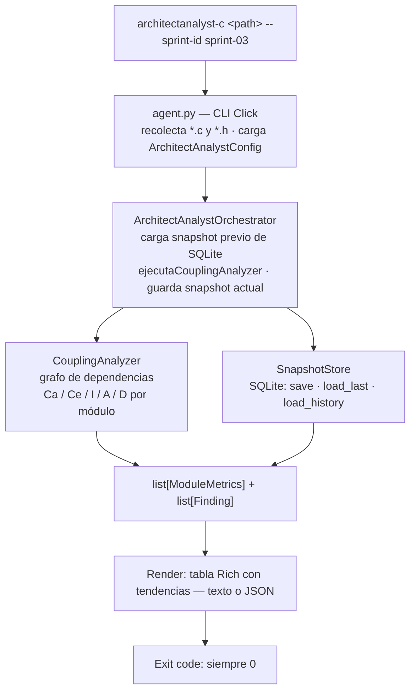

# ArchitectAnalyst-C — Documentación del agente

## Qué hace

ArchitectAnalyst-C calcula métricas de acoplamiento arquitectónico por módulo según el modelo de Robert C. Martin y persiste un snapshot de esas métricas en SQLite al final de cada sprint. En ejecuciones posteriores muestra la tendencia de cada métrica respecto al sprint anterior.

El agente está diseñado para correr al cierre de un sprint, no durante el desarrollo cotidiano. A diferencia de CodeGuard-C y DesignReviewer-C, **retorna siempre exit code 0** — sus findings son informativos, no bloqueantes. El objetivo es dar al equipo visibilidad sobre la evolución de la arquitectura a lo largo del tiempo.

No compila el código ni invoca herramientas externas. Parsea directivas `#include` directamente del texto fuente usando expresiones regulares.

---

## Arquitectura interna



El orchestrator carga el snapshot previo **antes** de guardar el actual, de modo que `load_last(sprint_id)` retorna la instantánea del sprint anterior para calcular los deltas.

---

## CouplingAnalyzer

### Grafo de dependencias

El analyzer recolecta todos los archivos `.c` y `.h` del scope de análisis (excluyendo los que coinciden con `exclude_patterns`) y los agrupa en **módulos** por el stem del nombre de archivo. `hal_uart.c` y `hal_uart.h` son el mismo módulo `hal_uart`; cuando ambos existen, se usa el `.h` como archivo representativo del módulo (necesario para calcular abstractness).

Para cada archivo se parsean las directivas `#include "..."` (solo includes locales con comillas; los includes de sistema con `<>` son ignorados). Si el stem del archivo incluido coincide con un módulo conocido y no es el mismo módulo que el archivo fuente, se registra una dependencia eferente.

### Métricas calculadas

| Métrica | Fórmula | Descripción |
|---------|---------|-------------|
| **Ca** — Afferent Coupling | conteo directo | Módulos que dependen de este módulo |
| **Ce** — Efferent Coupling | conteo directo | Módulos de los que depende este módulo |
| **I** — Instability | `Ce / (Ca + Ce)` | 0 = completamente estable, 1 = completamente inestable |
| **A** — Abstractness | `abstract_types / total_types` | 0 = concreto, 1 = completamente abstracto |
| **D** — Distance | `|A + I - 1|` | Distancia a la Main Sequence; 0 = ideal, 1 = extremo |

Si `Ca + Ce == 0` (módulo sin dependencias), `I = 0.0`.

### Cálculo de Abstractness en C

En los lenguajes OO, la abstractness se mide con clases abstractas e interfaces. En C, se aproxima usando el archivo `.h` representativo del módulo:

- **Tipos abstractos** (numerador): typedefs de puntero opaco (`typedef struct X * X_t;`) y forward declarations (`struct X;`) — son tipos cuya implementación está oculta al cliente del módulo.
- **Total de tipos** (denominador): número de `typedef`, definiciones de struct con cuerpo (`struct X { ... }`) y definiciones de enum con cuerpo.

Si el módulo no tiene `.h`, `A = 0.0`.

### Zonas de Martin

D = |A + I - 1| mide la distancia a la Main Sequence, la línea ideal donde `A + I = 1`:

- **Zone of Pain** (D → 1, I → 0, A → 0): módulo estable y concreto. Es difícil de cambiar y no es abstracto — cualquier cambio en sus responsabilidades requiere modificar código que otros módulos ya dependen. Frecuente en módulos de datos o estructuras globales muy usadas.
- **Zone of Uselessness** (D → 1, I → 1, A → 1): módulo inestable y abstracto. Es abstracto pero nadie depende de él, o todos sus dependientes son igual de inestables. Poco común en proyectos C embebidos.
- **Main Sequence** (D → 0): equilibrio entre estabilidad y abstracción. Los módulos estables tienden a ser abstractos; los módulos concretos tienden a ser inestables.

---

## SnapshotStore

Persiste los resultados de cada ejecución en una base de datos SQLite, una fila por módulo por sprint.

### Schema

```sql
CREATE TABLE snapshots (
    id           INTEGER PRIMARY KEY,
    sprint_id    TEXT NOT NULL,
    timestamp    TEXT NOT NULL,
    module       TEXT NOT NULL,
    ca           INTEGER,
    ce           INTEGER,
    instability  REAL,
    abstractness REAL,
    distance     REAL
);
```

### Operaciones

- `save(snapshot)` — inserta todas las filas del sprint actual. Crea el directorio padre del `.db` si no existe.
- `load_last(sprint_id)` — retorna el snapshot más reciente cuyo `sprint_id` es distinto del actual. Se llama antes de guardar el nuevo snapshot para obtener la referencia de comparación.
- `load_history()` — retorna todos los snapshots ordenados por timestamp. Útil para reportes de evolución.

La ruta del archivo `.db` se configura con `db_path` en `pyproject.toml`. El valor por defecto es `.quality_control/embedded_architecture.db`.

---

## Reglas y su valor en código embebido

### ARC001 — Instabilidad excesiva

**Qué detecta:** módulos cuyo índice de instabilidad (I) supera el umbral `max_instability` (default: 0.8).

**Por qué importa:** un módulo con I cercano a 1 tiene muchas dependencias eferentes y pocas aferentes. Cualquier cambio en sus dependencias puede obligar a modificarlo. En sistemas embebidos con requisitos de trazabilidad (IEC 62304, ISO 26262), un módulo muy inestable en la mitad de la arquitectura amplifica el impacto de los cambios y dificulta el análisis de impacto requerido por el estándar.

**Severidad:** WARNING.

### ARC002 — Distancia elevada (zona de advertencia)

**Qué detecta:** módulos cuya distancia D supera `max_distance_warning` (default: 0.3) pero no supera `max_distance_critical`.

**Por qué importa:** el módulo se está alejando de la Main Sequence — está ganando rigidez (estable y concreto) o inutilidad (inestable y abstracto) según la dirección. Es una señal temprana que merece atención antes de que se agrave.

**Severidad:** WARNING.

### ARC003 — Distancia crítica (Zone of Pain / Uselessness)

**Qué detecta:** módulos cuya distancia D supera `max_distance_critical` (default: 0.5).

**Por qué importa:** el módulo está en una de las dos zonas problemáticas. La Zone of Pain (D alto, I bajo, A bajo) es la más frecuente en C embebido: módulos de datos o configuración que son muy usados pero nunca se abstractizan. Con el tiempo se vuelven difíciles de cambiar sin efecto cascada. La corrección típica es introducir indirección — typedefs opacos, tablas de función, headers de interfaz separados de la implementación.

**Severidad:** CRITICAL.

---

## Tendencias entre sprints

La salida en modo texto muestra un símbolo de tendencia junto a I, A y D:

| Símbolo | Color | Significado |
|---------|-------|-------------|
| `↑` | rojo | La métrica empeoró respecto al sprint anterior |
| `↓` | verde | La métrica mejoró |
| `=` | gris | Sin cambio significativo (delta < 0.05) |
| *(vacío)* | — | Primera ejecución, sin referencia anterior |

Para I y D: subir es empeorar. Para A: bajar es empeorar (el módulo se vuelve más concreto).

Los módulos que aparecen en el sprint actual pero no en el anterior muestran la columna de tendencia vacía.

---

## Clasificación de severidades

| Severidad | Color | Significado operativo |
|-----------|-------|-----------------------|
| CRITICAL | rojo intenso | Módulo en Zone of Pain o Uselessness. Registrado en el reporte, no bloquea. |
| WARNING | amarillo | Instabilidad alta o distancia en zona de advertencia. |
| INFO | cyan | No utilizado en la versión actual. |

ArchitectAnalyst-C retorna **siempre exit code 0**. Los findings son informativos para guiar decisiones de refactoring, no gates de bloqueo.

---

## Limitaciones conocidas

**Approximación de abstractness:** el cálculo de A es una heurística basada en patrones de texto. No detecta abstracciones implementadas mediante convenciones de naming, tablas de función sin typedef explícito, o patrones de polimorfismo en C que no usen typedef de puntero opaco.

**Módulos sin header:** los archivos `.c` sin `.h` correspondiente tienen `A = 0.0` por definición, ya que no hay interfaz pública analizable. Esto puede inflar artificialmente D para módulos de implementación pura.

**Resolución de includes por stem:** si dos archivos en directorios distintos tienen el mismo stem (ej. `drivers/uart.h` y `app/uart.h`), ambos se tratarán como el mismo módulo — el último en ser procesado sobreescribe al anterior como archivo representativo. Evitar nombres de archivo duplicados en el proyecto.

**Sin análisis de macros:** los includes condicionados por `#ifdef` o que usan macros (`#include HEADER`) no son detectados.

**Rendimiento en proyectos grandes:** el análisis es O(N·M) donde N es el número de archivos y M el número promedio de includes por archivo. En proyectos de más de 10.000 archivos puede tardar varios minutos.
