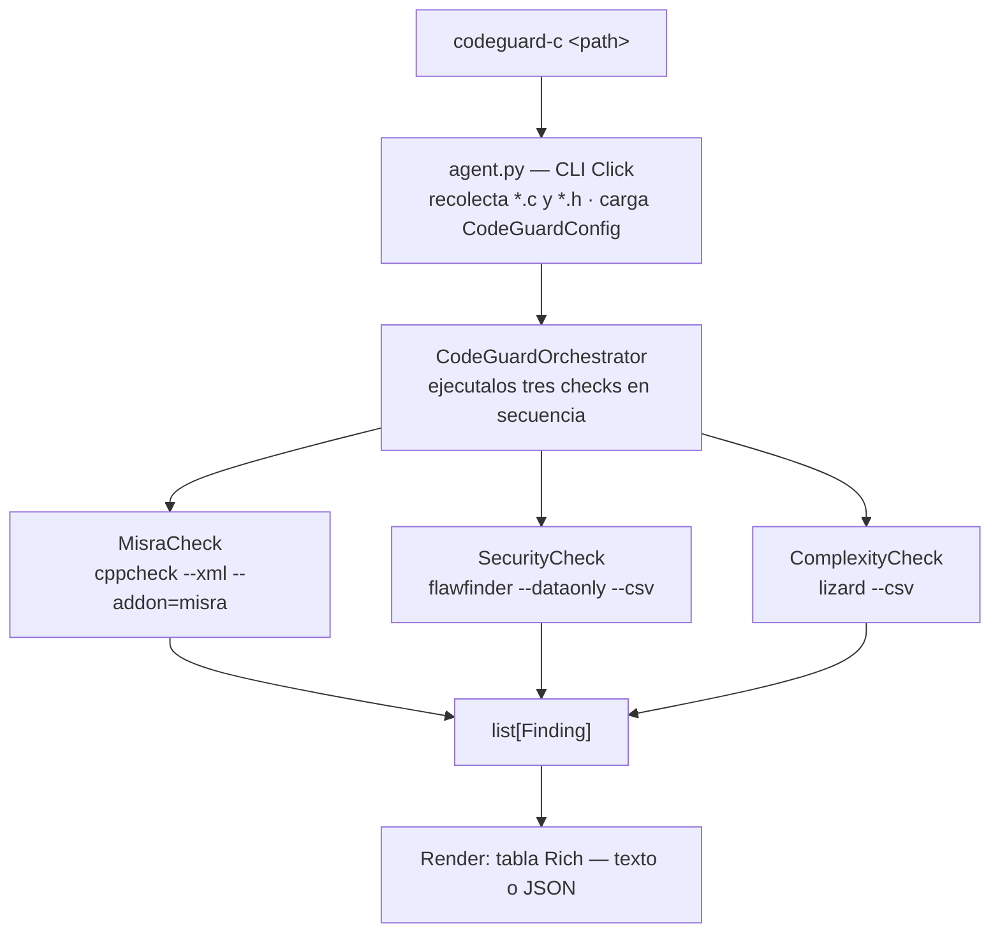

# CodeGuard-C — Documentación del agente

## Qué hace

CodeGuard-C analiza código fuente C en busca de tres categorías de problemas: violaciones del estándar MISRA C:2012, uso de funciones inherentemente inseguras, y métricas de complejidad fuera de umbral. Está diseñado para correr como hook pre-commit o en CI, con un presupuesto de análisis de 15 segundos.

El agente no compila el código. Todas las herramientas que usa operan sobre el texto fuente, lo que significa que funcionan sin toolchain, sin headers del sistema operativo embebido, y sin script de build.

---

## Arquitectura interna

Cada check recibe un `ExecutionContext` con la lista de archivos filtrada por `exclude_patterns`, invoca su herramienta externa como subproceso, parsea el output, y retorna una lista de `Finding`. El orquestador agrega todos los findings en un `Report` y mide el tiempo total.

---

## Las tres herramientas

### cppcheck + addon misra

cppcheck es un analizador estático de C/C++ que detecta defectos reales: punteros nulos, variables sin inicializar, accesos fuera de rango. Su addon `misra` extiende el análisis con las reglas de MISRA C:2012.

El output del análisis va a **stderr** en formato XML (versión 2). Una particularidad: cppcheck inyecta líneas de progreso (`Checking /path/to/file.c ...`) dentro del mismo stream XML, lo que rompe el parser. El agente las filtra antes de parsear.

### flawfinder

flawfinder hace búsqueda de patrones textuales en el código C buscando funciones con historial conocido de vulnerabilidades. No hace análisis de flujo: detecta la presencia de `gets()` independientemente de si en ese contexto específico podría ser explotada o no. Es rápido y produce muy pocos falsos negativos.

El output en modo `--csv` incluye una columna `Level` (1–5) que representa el riesgo intrínseco de la función, y una columna `RuleId` que identifica la regla específica (ej. `FF1014` para `gets`).

### lizard

lizard calcula métricas de complejidad de código C sin necesitar compilación ni headers. Opera función por función y reporta complejidad ciclomática (CCN) y longitud en líneas.

---

## Métricas y su valor en código embebido

### Complejidad ciclomática (CCN)

**Qué mide:** cantidad de caminos de ejecución independientes dentro de una función. Cada `if`, `else if`, `while`, `for`, `case`, `&&` y `||` suma 1 al contador. Una función sin bifurcaciones tiene CCN=1.

**Por qué importa:** en sistemas embebidos críticos (IEC 62304, DO-178C, ISO 26262) la complejidad ciclomática determina directamente la cantidad mínima de casos de prueba necesarios para cubrir todos los caminos. Una función con CCN=15 requiere en teoría 15 casos de prueba solo para cobertura de ramas. Funciones con CCN alto son también las más propensas a contener bugs ocultos en caminos raramente ejecutados.

**Umbral por defecto:** 10. En proyectos con certificación funcional se suele usar 4 o 6.

### Longitud de función (LOC)

**Qué mide:** cantidad total de líneas de una función, incluyendo comentarios y líneas en blanco.

**Por qué importa:** las funciones largas son difíciles de revisar, de testear unitariamente, y de mantener. En código embebido donde el stack es limitado, las funciones largas también tienden a acumular variables locales. Una función de 200 líneas es casi siempre una señal de que tiene más de una responsabilidad.

**Umbral por defecto:** 50 líneas.

### Funciones inseguras — nivel ≥ 4 (ERROR)

**Qué detecta:** funciones de la librería estándar C cuyo diseño no permite uso seguro o cuyo uso seguro requiere precauciones que en la práctica raramente se toman: `gets`, `strcpy`, `sprintf`, `scanf` sin especificador de ancho, entre otras.

**Por qué importa:** estas funciones son la causa histórica de la mayoría de los buffer overflows en C. `gets()` es el ejemplo extremo: no tiene parámetro de longitud, no puede usarse de forma segura bajo ninguna circunstancia, y fue eliminada del estándar C11. En firmware embebido un buffer overflow puede corromper el stack y causar comportamiento no determinístico en el sistema controlado.

**Severidad:** ERROR (nivel flawfinder ≥ 4).

### Funciones inseguras — nivel 2–3 (WARNING)

**Qué detecta:** patrones de riesgo moderado: arrays estáticos sin verificación de bounds, uso de `strncpy` (que no garantiza null-termination), punteros a funciones en contextos potencialmente peligrosos.

**Por qué importa:** no son defectos garantizados pero son señales de código que merece revisión. En proyectos con estándar de codificación estos patrones suelen requerir justificación explícita o comentario de supresión documentado.

**Severidad:** WARNING (nivel flawfinder 2–3).

### Violaciones MISRA-C Mandatory (CRITICAL)

**Qué detecta:** incumplimiento de las reglas del estándar MISRA C:2012 marcadas como Mandatory — aquellas de las que no se puede obtener desviación bajo ninguna circunstancia.

**Por qué importa:** las reglas Mandatory existen porque el comportamiento del código que las viola está directamente indefinido por el estándar C, o porque la ambigüedad que introducen es incompatible con análisis estático y verificación formal. Ejemplos representativos: no usar extensiones del lenguaje (1.2), no redefinir identificadores en scopes anidados (5.2–5.9), no asignar NULL como literal entero 0 (11.9).

En proyectos IEC 62304 Clase C o ISO 26262 ASIL-D, las violaciones Mandatory son no-conformidades que bloquean la certificación.

**Severidad:** CRITICAL.

### Violaciones MISRA-C Required (WARNING)

**Qué detecta:** incumplimiento de reglas Required — aquellas de las que se puede obtener una desviación documentada y justificada.

**Por qué importa:** las reglas Required cubren prácticas que aumentan la predictibilidad y testabilidad del código: un solo punto de retorno por función (15.5), no usar `goto` (15.1), uso consistente de tipos en expresiones (10.x). Una desviación no es una falla, pero debe estar registrada en el documento de desviaciones del proyecto.

**Severidad:** WARNING.

### Violaciones MISRA-C Advisory (INFO)

**Qué detecta:** incumplimiento de reglas Advisory — recomendaciones de buenas prácticas sin obligatoriedad.

**Por qué importa:** son señales de que el código se puede mejorar, no de que sea incorrecto. Útiles como baseline de calidad en revisiones de código o como objetivo de mejora continua.

**Severidad:** INFO. Deshabilitado por defecto (`misra_advisory = false`).

### Variables no inicializadas (ERROR)

**Qué detecta:** variables locales que se leen antes de recibir un valor asignado.

**Por qué importa:** en C el valor de una variable local no inicializada es indeterminado — no es cero ni ningún valor predecible. En sistemas embebidos el contenido del stack depende de la secuencia de llamadas anterior, lo que produce bugs que son difícilmente reproducibles y extremadamente difíciles de diagnosticar en campo. Los estándar de seguridad funcional los clasifican como defectos de Clase B.

**Severidad:** ERROR.

### Desreferencia de puntero nulo (ERROR)

**Qué detecta:** rutas de ejecución donde se accede a memoria a través de un puntero que cppcheck puede demostrar que es nulo en ese punto.

**Por qué importa:** en la mayoría de los microcontroladores embebidos la dirección 0 es memoria válida (registros de hardware, vectores de interrupción). Una desreferencia de puntero nulo no genera una excepción predecible como en sistemas operativos de propósito general — puede leer o escribir silenciosamente en áreas críticas del hardware.

**Severidad:** ERROR.

---

## Clasificación de severidades

| Severidad | Color | Significado operativo |
|---|---|---|
| CRITICAL | rojo intenso | Violación sin desviación posible. Requiere corrección antes del merge. |
| ERROR | rojo | Defecto real o función prohibida. Requiere corrección o supresión justificada. |
| WARNING | amarillo | Violación con desviación posible o riesgo moderado. Requiere revisión. |
| INFO | cyan | Observación. No requiere acción inmediata. |

El agente siempre retorna exit code 0 — no bloquea el commit. La decisión de bloquear o no es del proceso de CI del proyecto.

---

## Limitaciones conocidas

**Clasificación Mandatory/Required sin rule-texts:** cppcheck no expone la categoría MISRA de cada regla en el XML a menos que se provea el archivo `--rule-texts` (documento de pago de MISRA). El agente usa una lookup table interna basada en el estándar público. Si el proyecto tiene acceso al archivo de reglas, la clasificación puede refinarse.

**Análisis sin compilación:** las herramientas no procesan macros del preprocesador ni headers del sistema. Código que depende fuertemente de macros complejas puede producir falsos positivos o falsos negativos.

**Un archivo a la vez:** los checks de complejidad y seguridad analizan cada archivo de forma independiente. Defectos que solo son visibles con análisis interprocedural (ej. un puntero nulo que entra por parámetro desde otro módulo) no serán detectados.
