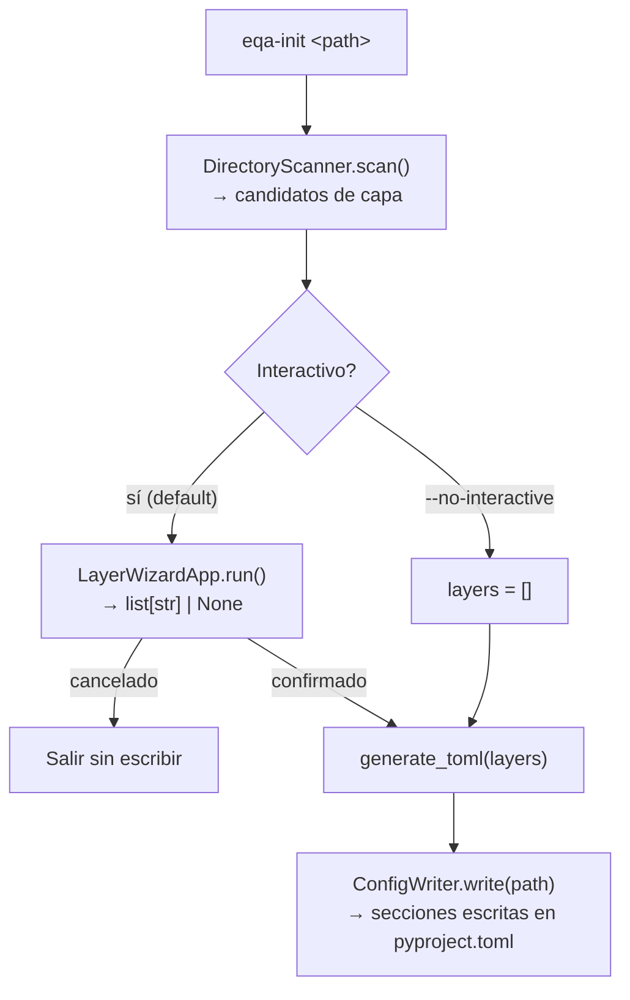

# eqa-init — Documentación del comando

## Qué hace

`eqa-init` bootstrapea la configuración de eqa-framework en un proyecto C existente. Escanea la estructura de directorios para detectar candidatos a capas arquitectónicas, lanza una TUI para que el desarrollador defina la jerarquía, y escribe las tres secciones `[tool.*]` en `pyproject.toml`. Si el archivo ya existe, appendea solo las secciones faltantes sin modificar el contenido previo.

El comando se corre una sola vez al incorporar eqa-framework a un proyecto. No analiza código — es un generador de configuración.

---

## Arquitectura interna



---

## DirectoryScanner

`src/eqa_framework/init/scanner.py`

Recorre el sistema de archivos buscando subdirectorios candidatos a capa:

```python
class DirectoryScanner:
    def scan(self, path: Path, src_dir: str | None = None) -> list[str]:
        ...
```

**Lógica de base de búsqueda:**

1. Si `src_dir` está explícito → usa `path / src_dir`.
2. Si `src_dir` es `None` → busca primero `path/src/`; si existe, la usa; si no, usa `path` directamente.
3. Si el directorio base no existe → retorna lista vacía.

**Filtro de ruido:** se excluyen los siguientes nombres independientemente de su contenido: `build`, `third_party`, `test`, `tests`, `mocks`, `generated`, `out`, `dist`, `.git`, y cualquier directorio cuyo nombre empiece con `.`.

El resultado se retorna ordenado alfabéticamente. El orden es puramente cosmético — la jerarquía real la define el usuario en la TUI.

---

## generate_toml y _derive_layers

`src/eqa_framework/init/writer.py`

### generate_toml

Produce un string con las tres secciones de configuración usando templates de texto. El resultado es TOML legible con comentarios inline y valores alineados.

Si `layers` es una lista no vacía, escribe `[tool.designreviewer-c.layers]` con las dependencias derivadas automáticamente. Si es vacía, escribe la sección con un comentario `# TODO` para edición manual posterior.

### _derive_layers

```python
def _derive_layers(ordered: list[str]) -> dict[str, list[str]]:
    return {layer: ordered[:i] for i, layer in enumerate(ordered)}
```

Dada la lista ordenada de menor a mayor nivel arquitectónico, cada capa puede depender de todas las capas anteriores en la lista:

```
["platform", "hal", "app"]  →  {
    "platform": [],
    "hal":      ["platform"],
    "app":      ["platform", "hal"],
}
```

Esta derivación asume una arquitectura estrictamente jerárquica. En proyectos con topologías no lineales (ej. `drivers` y `hal` al mismo nivel, ambos dependiendo de `platform`) el resultado debe ajustarse manualmente en el `pyproject.toml`.

### ConfigWriter

```python
class ConfigWriter:
    def write(self, path: Path, toml_block: str) -> list[str]:
        ...
```

- Si `path/pyproject.toml` no existe: lo crea con el bloque completo.
- Si existe: lee el contenido, detecta qué secciones de las tres ya están presentes (por búsqueda de string del marcador), y appendea solo las ausentes.
- Retorna la lista de marcadores efectivamente escritos. Lista vacía significa que todas las secciones ya estaban presentes y no se modificó nada.

La detección de secciones existentes es por búsqueda de string exacto (`"[tool.codeguard-c]"` en el contenido). No parsea el TOML — esto evita dependencias adicionales y es suficientemente robusto para el caso de uso.

---

## LayerWizardApp

`src/eqa_framework/init/app.py`

TUI Textual que muestra las capas detectadas en una tabla ordenable. El usuario define la jerarquía reordenando las capas de menor a mayor nivel antes de confirmar.

### Bindings

| Tecla | Acción |
|-------|--------|
| `Shift+↑` | Mueve la capa seleccionada hacia arriba (nivel más bajo) |
| `Shift+↓` | Mueve la capa seleccionada hacia abajo (nivel más alto) |
| `A` | Agrega una nueva capa (modal con input de texto) |
| `X` | Elimina la capa seleccionada |
| `Enter` | Confirma la jerarquía y cierra la TUI |
| `Q` / `Esc` | Cancela sin escribir ningún archivo |

### Resultado

La app retorna `list[str] | None` vía `self.exit(result)`:
- `list[str]`: lista de capas en el orden confirmado por el usuario.
- `None`: el usuario canceló. `agent.py` imprime un mensaje y sale con exit code 0 sin escribir nada.

### Validación de nombres de capa

Los nombres ingresados al agregar una capa pasan por `_clean_layer_name()` (strip + lowercase) y `_is_valid_layer_name()` (no vacío, sin espacios). Si el nombre ya existe en la lista, se notifica al usuario sin agregarlo.

---

## Defaults generados

Los valores que `generate_toml` escribe para las tres secciones:

| Sección | Clave | Valor |
|---------|-------|-------|
| `[tool.codeguard-c]` | `max_cyclomatic_complexity` | 10 |
| `[tool.codeguard-c]` | `max_function_lines` | 50 |
| `[tool.codeguard-c]` | `exclude_patterns` | `["build/", "third_party/"]` |
| `[tool.codeguard-c.checks]` | `misra_mandatory` | true |
| `[tool.codeguard-c.checks]` | `misra_required` | true |
| `[tool.codeguard-c.checks]` | `misra_advisory` | false |
| `[tool.codeguard-c.checks]` | `security` | true |
| `[tool.codeguard-c.checks]` | `complexity` | true |
| `[tool.designreviewer-c]` | `max_fan_out` | 12 |
| `[tool.designreviewer-c]` | `exclude_patterns` | `["build/", "third_party/"]` |
| `[tool.architectanalyst-c]` | `max_instability` | 0.8 |
| `[tool.architectanalyst-c]` | `max_distance_warning` | 0.3 |
| `[tool.architectanalyst-c]` | `max_distance_critical` | 0.5 |
| `[tool.architectanalyst-c]` | `db_path` | `.quality_control/architecture.db` |
| `[tool.architectanalyst-c]` | `exclude_patterns` | `["build/", "third_party/"]` |

---

## Limitaciones conocidas

**Detección de secciones por búsqueda de string:** si el `pyproject.toml` existente contiene el texto `[tool.codeguard-c]` en un comentario o en una cadena, el detector lo considerará como sección presente y no escribirá esa sección. En la práctica esto no ocurre en archivos TOML reales.

**Derivación jerárquica estricta:** `_derive_layers` asume que cada capa puede depender de todas las capas de menor nivel. Arquitecturas con dependencias selectivas (ej. `services` depende de `hal` pero no de `platform`) requieren edición manual del `pyproject.toml` generado.

**Sin detección de profundidad:** el scanner detecta solo los subdirectorios inmediatos del directorio base. Proyectos con capas anidadas en subdirectorios más profundos (ej. `src/drivers/hal/`) no son detectados automáticamente.

**La TUI requiere terminal interactiva:** `LayerWizardApp` no funciona en entornos sin TTY (pipes, CI sin `-it`). Para esos contextos usar `--no-interactive`.
